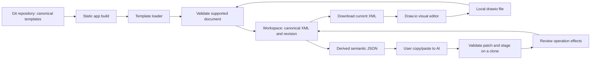

# Product vision and architecture

Decision owner: tech lead. Initial decisions: 2026-09-08. This is the target design; see the baseline audit for what actually exists.

## Product destination

DrawCloud helps someone start from a useful cloud architecture, make a precise AI-assisted change, inspect it, and continue editing in Draw.io without losing layout or ownership of the file. The primary journey is **find pattern → load XML → copy AI context → review patch → apply/undo → download → edit in Draw.io → reimport**.

The existing README is the product brief until the user changes it. Templates should eventually explain when a pattern fits, its assumptions and tradeoffs, rather than presenting a few provider boxes as a production-ready architecture. Start with the five existing provider families; do not invent a paid service, collaborative editor or cloud provisioning product.

Success means: supported diagrams round-trip without unintended semantic changes; invalid requests leave the document intact; users can identify the current document and recover from mistakes; templates are usable from the deployed app without depending on a moving GitHub branch. Track those outcomes through contract and journey tests, not feature counts.

## Boundaries and flow

Draw.io owns rendering, geometry editing, routing and exports. Git owns archive/history through ordinary file workflows. DrawCloud owns catalog metadata, the local working document, validation, narrow patch application, recoverability and honest handoff. Git links do not mean the app saves to Git. AI JSON is a derived view, never the persistence format.

## Module responsibilities

Names below are a suggested small structure; equivalent clear boundaries are acceptable without lead approval.

| Boundary | Responsibility | Must not own |
| --- | --- | --- |
| `src/lib/drawio/document.ts` | Parse, classify support, index cells, enforce invariants, serialize | React state, network, clipboard |
| `src/lib/drawio/semantic.ts` | Derive versioned AI document from validated XML | Regenerate XML from JSON |
| `src/lib/drawio/patch.ts` | Validate unknown input, simulate sequential operations, report effects | Commit to workspace or silently repair IDs |
| `src/lib/drawio/errors.ts` | Stable diagnostic codes and readable messages | UI framework types |
| `src/data/templates.ts` and template loader | Metadata and build-associated XML | Moving remote content as the only source |
| Workspace hook/reducer | Current document, provenance, revision, staged patch and undo | XML mutation rules |
| Small UI components | Catalog, file actions, AI text, review, status | A second graph/document model |
| Browser IO helper | Clipboard, file reading, download lifecycle, repository links | Domain decisions |

Retain compatibility exports from `src/lib/drawio.ts` if useful. Avoid a plugin system, global state library or generic graph framework for this scope. Create abstraction only for a real responsibility.

## Non-negotiable invariants

1. XML is canonical. Semantic JSON is calculated from the same validated document revision shown in the workspace.
2. Within a supported graph, every cell ID is present and unique, including structural IDs. New IDs are exact caller-specified IDs; collisions are errors, never automatic suffixes.
3. A patch is an ordered transaction on a private document. Validation, simulation, post-validation and semantic export must all succeed before any workspace replacement. A failure at the last operation leaves the source XML and workspace history unchanged.
4. Existing XML attributes, styles, metadata, geometry and edge waypoints survive unless an allowed operation explicitly changes them. Structural equivalence is required; serializer whitespace or attribute-order changes do not violate the contract. Avoid serialization entirely for no-op operations where feasible.
5. No hidden document switching: failed or obsolete loads cannot overwrite a newer selection; previews become invalid on document or patch changes.
6. Rendering patch labels in the app uses escaped text. Never insert imported labels as HTML or execute instructions from file content. Preserve existing Draw.io label/style strings as data; DrawCloud is not a sanitizer for a third-party editor.
7. Unsupported structures are rejected with recovery instructions, never converted to an empty diagram or silently flattened. Supporting more XML requires explicit fixtures and a deliberate contract extension.
8. No network transmission of local XML or pasted AI text is required. The user chooses the external AI workflow. Third-party editing is a deliberate file handoff.

## Decision record

| ID | Decision and rationale | Revisit when |
| --- | --- | --- |
| ADR-001 | Keep static React/TypeScript/Vite app and Fluent UI. Keep GitHub as source archive; no backend or database needed for the core workflow. | A concrete feature requires durable shared server state |
| ADR-002 | S001 supports one uncompressed graph with one layer and flat vertices/edges. Reject other structures instead of risking file corruption. Exact profile is in S001. | S003 compatibility fixtures and page-scoped design are approved |
| ADR-003 | Keep v1 operation names; add strict runtime validation and reject collisions/unknown fields. Type assertions are not validation. Full style replacement is allowed only when explicitly requested. | Versioned richer operations or metadata become necessary |
| ADR-004 | Stage a candidate XML and effect summary, then explicitly apply it; offer bounded undo. Never reconstruct the file from the semantic export. | Longer history/recovery needs justify persistence |
| ADR-005 | Ship template XML with the build using raw asset imports or an equivalent deterministic build step. Keep repository links separate. | A larger remote catalog needs version pinning/caching |
| ADR-006 | Use real-browser XML tests and user-journey tests. Medium builds the harness/regressions; light independently challenges results. | Measured test cost merits changing the harness |
| ADR-007 | Only the lead accepts a sprint and changes architecture. Light may triage, maintain evidence and flag likely logic faults. | User changes ownership |

## Subsequent capabilities and reasons

- **Revision-bound AI requests:** prevent an old response from modifying a different document with reused IDs. S002 should specify a new versioned contract with document/page identity and a base revision/content fingerprint. Do not silently change v1 to claim this guarantee.
- **Local recovery:** recover drafts after reload/closure, with clear save/discard behavior and storage failure handling. This follows an explicit workspace model.
- **Broader Draw.io compatibility:** compressed files, multiple pages, layers, groups and wrapped cells. Page-local IDs and parent relationships require design before implementation; do not flatten them.
- **Useful template library:** real previews, use cases, tradeoffs, provenance and reviewed cloud patterns. Provider icons are secondary to accurate content.
- **Current-document editor integration:** a controlled Draw.io embed could reduce file handoffs later. It must load the actual working XML, validate origin/source of messages and define save/cancel behavior. It is optional, not a prerequisite for the MVP.
- **Optional Git write/AI/MCP automation:** only after the local contract is reliable and the user chooses a real need. No mandatory account or API key in the core path.

## Known boundary after S001

Legacy v1 patches cannot prove which copied source they came from. Review and undo reduce mistakes but do not provide stale-AI-response detection. Refresh recovery and complex Draw.io documents also remain unavailable until their sprints. Document these limitations in user help; do not advertise general Draw.io compatibility or complete loss prevention.

## Implementation references

Draw.io exposes a page's source as `mxGraphModel`; XML export supports an uncompressed option. These inform the supported import profile and help text. [Diagram source editing](https://www.drawio.com/docs/manual/advanced/diagram-source-edit/), [XML export](https://www.drawio.com/docs/manual/export/export-to-xml/).

Vite supports raw asset imports for template content. [Static asset handling](https://vite.dev/guide/assets.html). Vitest Browser Mode runs with browser globals and supports a Playwright provider; use the installed version's documented configuration. [Browser Mode](https://vitest.dev/guide/browser/). Playwright provides the separate app-journey runner. [Installation](https://playwright.dev/docs/intro).
